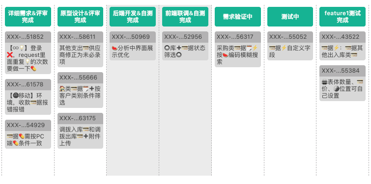

### 简介

为方便各位小伙伴，在使用「用户故事列表」的时候，能更好地找到当前和已完成的任务，我制作了这个插件。

### 安装

1. 点击上方的 vue-chrome-extension-boilerplate-vx.x.x.zip，跳转后，再点击 Download 按钮进行下载
2. 解压压缩包
3. 用「Chrome 浏览器」，找到「设置-扩展插件（Extensions）」
4. 开启右上角的「Developer mode」，选择加载插件（Load uppacked）
5. 加载解压出来的内容，完成
6. 刷新 https://devops.kingdee.com:8000/index.html，在「用户故事列表」页面点插件图标，即可显示

### 未来功能

- [x] 按照进度排列任务
- [x] 水墨风格配色
- [ ] 扁平风格配色
- [ ] 增加勾选功能
- [ ] 自定义各个列的背景色
- [ ] 自定义各个列的顺序